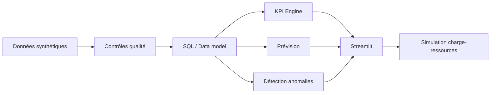

# PILOT'IA — Plateforme intelligente de pilotage d'activité

Prototype Data / Analytics de bout en bout : qualité de service, délais, charge-ressources,
productivité, prévision et détection d'anomalies.

> **Important :** ce projet utilise uniquement des données synthétiques. Il ne contient aucune donnée
> réelle d'assuré, de santé ou de la CNAM.

## Fonctionnalités

- dashboard exécutif ;
- suivi des volumes reçus / traités / backlog ;
- taux de réalisation, succès, échec et respect des SLA ;
- analyse des délais par caisse et service ;
- contrôle qualité automatique ;
- simulation charge ↔ ressources ;
- recommandation de besoin en ETP ;
- prévision à 7 / 30 jours ;
- détection d'anomalies avec Isolation Forest ;
- architecture compatible PostgreSQL ;
- Docker ;
- tests Pytest ;
- CI GitHub Actions.

## Stack

Python · Pandas · NumPy · Scikit-learn · Plotly · Streamlit · SQL · PostgreSQL · Docker · Pytest

## Lancer localement

```bash
git clone <URL_DU_REPO>
cd pilotia
python -m venv .venv
```

Windows :

```bash
.venv\Scripts\activate
```

Puis :

```bash
pip install -r requirements.txt
streamlit run app/main.py
```

La première exécution génère automatiquement les données synthétiques.

## Déployer sur Streamlit Community Cloud

1. Pousser le projet sur GitHub.
2. Ouvrir Streamlit Community Cloud.
3. Sélectionner le dépôt.
4. Fichier principal : `app/main.py`.
5. Cliquer sur **Deploy**.

## Docker

```bash
docker build -t pilotia .
docker run -p 8501:8501 pilotia
```

Application :

```text
http://localhost:8501
```

## PostgreSQL

```bash
docker compose up -d
python src/load_postgres.py
```

Schéma : `sql/schema.sql`

## Architecture



## Structure

```text
pilotia/
├── app/main.py
├── src/
│   ├── data_generator.py
│   ├── metrics.py
│   ├── data_quality.py
│   ├── forecasting.py
│   ├── anomaly_detection.py
│   ├── capacity.py
│   └── load_postgres.py
├── sql/schema.sql
├── tests/test_core.py
├── .github/workflows/ci.yml
├── Dockerfile
├── docker-compose.yml
├── requirements.txt
├── PROJECT_PITCH.md
└── EMAIL_CANDIDATURE.md
```

## Data science

### Prévision
Régression Ridge sur tendance + saisonnalités hebdomadaire et annuelle.

### Anomalies
Isolation Forest sur :
- volume ;
- délai médian ;
- taux de succès ;
- taux de respect du SLA.

Les anomalies sont des **signaux à investiguer**, jamais des décisions automatiques.

## Gouvernance

- données 100 % synthétiques ;
- aucun nom / prénom ;
- aucun identifiant réel ;
- aucune donnée de santé individuelle ;
- minimisation ;
- agrégation ;
- séparation des couches data / métier / interface.

## Positionnement

Ce projet ne reproduit pas un système réel de l'Assurance Maladie.
Il montre une manière de traiter un problème de pilotage de bout en bout :
**besoin métier → données → qualité → SQL → analyse → prédiction → recommandation → restitution.**

## Auteur

**Khadidiatou Kenewy Diallo**  
Data Analyst / Data Scientist
